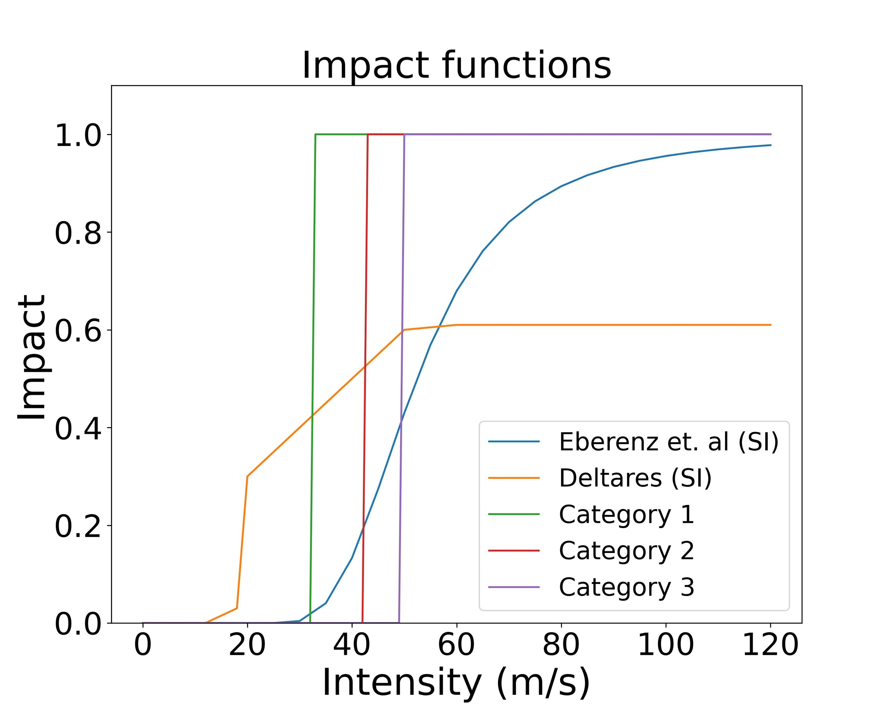

# Impact-based Forecast for Critical Infrastructure during Tropical Cyclones 

Forecasting the potential impact of weather extremes in the weeks to days before they happen can help increase the preparedness in the areas that might be
affected. The emerging field of research on impact-based forecast models is instrumental in this regard, aiding international organizations and governments in making informed decisions,
taking early actions, and allocating resources efficiently. This study aims to build upon the pioneering research of the Weather4UN project, by developing and impact forecast tool of
tropical cyclones on critical infrastructure. While earlier efforts concentrated on estimating the potential affected population, our focus shifts to understanding the impact on critical
infrastructure, starting with healthcare facilities, schools and road networks. We present a case study of Tropical Cyclone (TC) Freddy, which hit Mozambique and Madagascar in 2023.
We calculate direct impacts using two sets of vulnerability curves for structural damage and another based on the Saffir-Simpson scale to ensure global applicability when needed. To
better understand the significance of these impacts, we further assess their indirect effects on the population.

## Structure
The scripts consist in: 
- Hazard data (Fetching the forecast) ECMWF 51 ensemble members (IFS Cycle 47r3)
- Exposure data:
  Hospitals, Educational facilities, roads
  Worldpop (UN adjust 2020)
- Impact Function/ vulnerability:
  Eberenz et. al (2021) & Deltares Institute (Global Facility for Disaster Reduction and Recovery, 2023)
  Saffir Simpson hurricane wind scale

## Forecast Fetching

This function in the code look for the files that correspond to the event that we want to analyze. In order to use this function, you should have the files in your own computer or server

**fetch_multiple_ecmwf_data(base_folder, start_date, end_date, event_name)**

- base_folder= "/cluster/project/climate/gespejo/data/TC_0012"  change this path with your own data.

- start_date = datetime(2023,2,16,18,0) refers to the start of the event; year,month,day,UTC. 

- end_date = datetime(2023, 2,21,18, 0)  refers to the end of the event; year,month,day,UTC. 

- event_name = "FREDDY"  refers to the name of the event. In this case is FREDDY.

In our case we are using a lead time of 5 days. 

## Centroids

**from climada.hazard import Centroids**

min_lat, max_lat, min_lon, max_lon = -27,-10, 42, 52

cent = Centroids.from_pnt_bounds((min_lon, min_lat, max_lon, max_lat), res=0.12)

cent.check()

This code is set within the region of study, which in this case corresponds to Madagascar (MDG).

## Factor Intensity

**tc_intensity_10min(tc_object, factor)**

"""
    Modifies the intensity of a TropCyclone object.

    Parameters:
    tc_object: TropCyclone object to be modified.
    factor: The factor by which to multiply the intensity.

    Returns:
    Modified TropCyclone object.
    """
For the vulnerability curve from the Deltares Institute (Global Facility for Disaster Reduction and Recovery, 2023). It is needed to use this factor conversion.

## Exposure

In this part in order to work with the exposure data, it is needed to put the location of your data. To download the Openstreetmap data, you should follow
the instructions from https://github.com/CLIMADA-project/climada_petals/blob/main/doc/tutorial/climada_exposures_openstreetmap.ipynb

"""python

PATH_DATA = '/cluster/project/climate/gespejo/data/infrastructure/'

PATH_DATA_OSM = '/cluster/work/climate/gespejo/climada/data/openstreetmap/' # path to search for osm.pbf files and to download to if not existing

PATH_DATA_HVMV = PATH_DATA +'power_global/grid.gpkg' # path of this file from gridfinder (It needs to be downloaded).

PATH_DATA_PP = PATH_DATA +'power_global/global_power_plant_database.csv' # path of this file from WRI global power plant db. (It needs to be downloaded).

#PATH_DATA_CT = PATH_DATA +'cell_towers/opencellid_global_1km_int.tif' # path of this file from worldbank open data gridded celltowers (It needs to be downloaded)

PATH_DATA_POP = PATH_DATA + 'population/' # path to search for population files and to download to if not existing

PATH_SAVE = '/cluster/project/climate/gespejo/data/infrastructure/Madagascar_results_'

"""

## Cleaning exposure data & Classification of the Hospitals for levels 

**_find_duplicates(overlap_gdf)**  look for the duplicate points 

**_remove_duplicates(orig_gdf, indices_dupl)**  remove the duplicates points 

**find_remove_duplicates(orig_gdf)**  here in a single function does both actions, first look for the duplicates and then remove them. 

Each geometric point includes latitude, longitude, value, amenity, as well as the names of hospitals, schools, roads, etc. In the case of health facilities, a categorization of hospital types
is established. The initial data was provided by OpenStreetMap. This categorization was then updated based on reports developed by the Deltares Institute, documents from the World Bank’s
Health Sector, and the Strategic Health Plan of Mozambique, which helped us to establish the
criteria for this classification.(Global Facility for Disaster Reduction and Recovery, 2023; Ministerio
da Saude - Republica de Mozambique, 2007; “Plan de developpement du secteur sante”, 2020-2024;
World Bank Group - International Development, Poverty, 2014). The classification consists:

1. Level 1: clinics in rural areas
2. Level 2: rural hospitals with higher population coverage
3. Level 3:hospitals with provincial coverage
4. Level 4: hospitals located in urban areas

## Impact Functions / Vulnerability 

In the class **ImpFuncsCIWindMoz** we set a total of 5 impact functions. 



## Impact calculations 

The impact calculations are performed using this model code. The country code can be changed to the corresponding country, such as MDG, MOZ, or REU. imph1 is the list where the impact calculations per day are saved. This same structure of code has been applied for educational facilities and roads, which have been disaggregated into geometric points. Once it is done, we used the calc_mean_for_impdict(impact_dict) this function to calculate the mean value over the 51 ensemble members. 

```python
import copy
from climada.engine import Impact  

# Specify the country code
country_code = 'MDG'

# Initialize a dictionary to store all impact objects with their respective names
imph1 = {}

# Your tc_names and other required parameters must be defined before this section of the code 
# Ensure that all necessary data and objects are adequately initialized.

# Iterate through track variables
for track_name_variable in tc_names:
    
    # Create a copy of the GeoDataFrame for health data based on the specified country
    if country_code == 'MDG':
        gdf_health_df = copy.deepcopy(gdf_health_MDG)
    else:
        # Handle other countries as needed
        pass

    # Assuming 'track_name_variable' is the key in tc_names dictionary, referring to track objects
    track_obj = tc_names[track_name_variable]

    # Create Impact objects and calculate impacts for impact1
    impact_var_name1 = f'imph1_{country_code}_{track_name_variable}'  # Customized name for impact1
    
    # Initialize and calculate the Impact object
    impact1_obj = Impact()
    impact1_obj.calc(eval(f'exp_h1_{country_code}'), impf_set_tc, track_obj, save_mat=True)
    
    # Add the impact object to the dictionary with its name as the key
    imph1[impact_var_name1] = impact1_obj
```

## Plotting impact based forecast maps per day 

For this map, we have developed two functions: **ext_col_categories(exp_instance, date_forecast)** and **extract_points_to_plot(exposures_dict, exp_key, date_forecast, event_date)**. The first function extracts the columns that correspond to the impact per day calculated previously. The second function, which operates in dependence on ext_col_categories, extracts the points per day and calculates the lead time based on the start and end of the event.

```python
# Using the extract_points_to_plot function: to extract the most important data from the geometric points. exposures_dict corresponds to the dictionary containing the exposures, imph1 to the dictionary with the impact values. '20230216180000' denotes the start of the event, and '20230221180000' denotes the end of the event.

p_imph1_plot = extract_points_to_plot(exposures_dict, 'imph1','20230216180000','20230221180000')
p_imph2_plot = extract_points_to_plot(exposures_dict, 'imph2','20230216180000','20230221180000')

# Extracting values from points_to_plot
exp_longitude = p_imph1_plot['longitude']
exp_latitude = p_imph1_plot['latitude']
exp_impact = p_imph1_plot['impact_data'] ['impact']
exp_levels = p_imph1_plot['level_data']
lead_time = p_imph1_plot ['lead_time']
```
Once it is done, then the function plot_tracks can be used: 

```python
plot_tracks(tc_tracks, exp_lon, exp_lat, exp_value,exp_level,figure_filename):

tc_tracks = tens_variables ['ens_FREDDY_20230216180000']
event = 'TC Freddy'
filename= "/cluster/project/climate/gespejo/MDG_struc_plots_Freddy/MDG_20230216180000_strucimpforecast_imph2.jpg"
plotting_tracks = plot_tracks(ens_variables ['ens_FREDDY_20230216180000'],exp_longitude,exp_latitude,exp_impact,exp_levels,filename)
```
## INDIRECT IMPACTS 

To calculate the nearest population affected when a hospital is disrupted, the following function has been developed.

calculate_nearest_population(geodisrupt_gdf, pop_gdf):


    """
    Calculate the nearest population point for each entry in GeoDataFrames within geodisrupt2_dfs.

    Parameters:
    - geodisrupt_gdf: Dictionary of GeoDataFrames where nearest population will be calculated for each entry.
    - pop_gdf: GeoDataFrame representing population data.

    Returns:
    - geodisrupt_gdf: Dictionary of updated GeoDataFrames with nearest population index and affected population.
    """

In the case that we want to determine the nearest population affected beyond the threshold of disruption when an infrastructure fails, the function **cal_nearestpop_disrup** should be used.

cal_nearestpop_disrup(geodisrupt_gdf, disrupt_data_gdf):
    """
    Calculate the nearest population point for each entry in GeoDataFrames within geodisrupt_gdf
    using the corresponding GeoDataFrames in disrupt_data_gdf.

    Parameters:
    - geodisrupt_gdf: Dictionary of GeoDataFrames where nearest population will be calculated for each entry.
    - disrupt_data_gdf: Dictionary of GeoDataFrames representing population data for different days.

    Returns:
    - geodisrupt_gdf: Dictionary of updated GeoDataFrames with nearest population index and affected population.
    """

